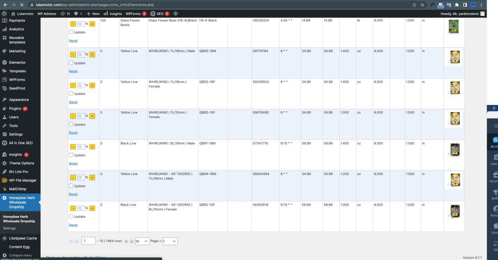

# Zoho Plugin for WooCommerce

This WordPress plugin connects your website with **Zoho** via API, allowing you to sync products from Zoho to your site and send sales data back to Zoho.

It is designed for clients using **Zoho Inventory / Zoho One** as an ERP system and **Shopify** as a retail platform. With this plugin, you can manage product data and sales integration without using Shopify.

---

## Features

- Connects to Zoho API and fetches all products (manually or automatically via cron jobs)
- Displays products in a detailed table with multiple data fields, including images
- Links products in the table with products on the WooCommerce site and updates them automatically (price, quantity, etc.)
- Allows selecting pricing strategy:
    - Keep the same price
    - Increase price by 10%
    - Decrease price by 10%
- Works with WooCommerce, cron, and Zoho API

---

## Installation

1. Clone or download the repository:
   ```bash
   git clone https://github.com/andrewpuzyrevichG/zoho_plugin.git
2. Copy the folder into /wp-content/plugins/.

3. Activate the plugin via Plugins → Activate in WordPress admin.

## Screenshots

| Screenshot | Description |
|------------|-------------|
|  | Displays all products fetched from Zoho with detailed data and images. |

## Changelog

### Version 1.0.0
- Initial release
- API integration for products and sales synchronization
- Manual and cron-based product import
- Automatic product updates on WooCommerce
- Pricing options implemented
